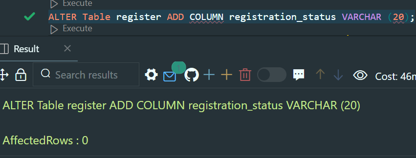
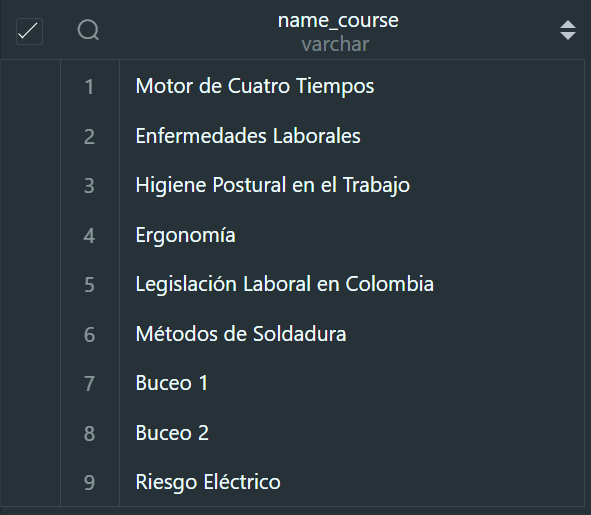

<!DOCTYPE html>
<html lang="en">
<head>
    <meta charset="UTF-8">
    <meta name="viewport" content="width=device-width, initial-scale=1.0">
    <title>Presentacion</title>
    <!--=============== REMIXICONS ===============-->
    <link href="https://cdn.jsdelivr.net/npm/remixicon@3.2.0/fonts/remixicon.css" rel="stylesheet">
    <!--=============== CSS ===============-->
    <link rel="stylesheet" href="css/style.css">
</head>
<body>
    <section>
        <section class="parallax-1">
            

                <h1>SENA</h1>
            

        </section>
        <marquee>
            <h2>
                Servicio Nacional de Aprendizaje
            </h2>
        </marquee>
        

            El Servicio Nacional de Aprendizaje SENA está implementando sus nuevas
            rutas de aprendizaje basada en cursos interrelacionados, en la que una
            carrera consta de varios cursos consecutivos organizados en rutas.
        

        <section class="parallax-2">
            

                <h1>Servicio Nacional</h1>
            

        </section>
         
            <h2>
                Diseño Base de Datos 
            </h2>
        

            Una carrera puede tener hasta tres rutas de aprendizaje dependiendo del
            énfasis de la carrera. Por ejemplo, la Carrera Electrónica puede tener énfasis
            en: Robótica, Micro-controladores o Dispositivos Bio-Médicos, por lo tanto,
            tendrá tres rutas de aprendizaje. La Carrera de Desarrollo de Software puede
            tener énfasis en Sistemas de Información Empresariales, Desarrollo de
            VideoJuegos o Aprendizaje de Máquinas.
        

         
        

            <a href="#diagrama_entidad_relacion" class="button">
                

                    Diagrama Entidad
                    <i class="ri-artboard-line button_icon"></i>
                    

                    

                

                
                
                
                
                
                
                

            </a>
            <a href="#diagrama_relacional" class="button">
                

                    Diagrama Relacional
                    <i class="ri-artboard-line button_icon"></i>
                    

                    

                

                
                
                
                
                
                
                

            </a>
            <a href="#modelo_base" class="button">
                

                    Modelo Base
                    <i class="ri-database-2-line button_icon"></i>
                    

                    

                

                
                
                
                
                
                
                

            </a>
            <a href="#consultas" class="button">
                

                    Consultas
                    <i class="ri-terminal-box-line button_icon"></i>
                    

                    

                

                
                
                
                
                
                
                

            </a>
        

        

            <!-- <marquee> -->
                <h2>
                    Diagrama Entidad Relación
                </h2>
            <!-- </marquee> -->
            

                

                

                

                

            

        

        

            <!-- <marquee> -->
                <h2>
                    Diagrama Relacional
                </h2>
                

                

                
                    
                
            <!-- </marquee> -->
        

        

            <!-- <marquee> -->
                <h2>
                    Modelo Base
                </h2>
            <!-- </marquee> -->
               
            

                

                    

                        

                            <h2 style='user-select: none'>01</h2>
                            <h3 style='user-select: none'>Specialty</h3>
                            

                                CREATE TABLE `specialty` (
                                    `code_specialty` int primary key,
                                    `name_specialty` varchar(20) NOT NULL);
                            

                        

                    

                

                

                    

                        

                            <h2>02</h2>
                            <h3>Career</h3>
                            

                                CREATE TABLE `career` (
                                    `code_career` int NOT NULL,
                                    `name_career` varchar(80) NOT NULL,
                                    PRIMARY KEY (`code_career`));
                            

                        

                    

                

                

                    

                        

                            <h2>03</h2>
                            <h3>Instructor</h3>
                            

                                CREATE TABLE `instructor` (
                                `id_instructor` int primary key,
                                `name_instructor` varchar(50),
                                `last_name_instructor` varchar(50));
                            
 
                        

                    

                

                

                    

                        

                            <h2>04</h2>
                            <h3>Course</h3>
                            

                                CREATE TABLE `course` (
                                `code_course` int primary key,
                                `name_course` varchar(80));
                            
 
                        

                    

                

                

                    

                        

                            <h2>05</h2>
                            <h3>Route</h3>
                            

                                CREATE TABLE `route` (
                                `number_route` int primary key,
                                `name_route` varchar(50),
                                `code_career` int,
                                CONSTRAINT 
                                FOREIGN KEY (`code_career`)
                                REFERENCES `career` (`code_career`));
                            
 
                        

                    

                

                

                    

                        

                            <h2>06</h2>
                            <h3>Register</h3>
                            

                                CREATE TABLE `register` (
                                `code_register` int primary key,
                                `number_route` int,
                                `registration_status` varchar(20),
                                CONSTRAINT
                                FOREIGN KEY (`number_route`)
                                REFERENCES `route` (`number_route`));
                            
 
                        

                    

                

                

                    

                        

                            <h2>07</h2>
                            <h3>Apprentice</h3>
                            

                                CREATE TABLE `apprentice` (
                                `id_apprentice` int PRIMARY KEY,
                                `name_apprentice` varchar(50),
                                `last_name_apprentice` varchar(50),
                                `code_register` int,
                                `age_apprentice` int,
                                CONSTRAINT
                                FOREIGN KEY (`code_register`)
                                REFERENCES `register` (`code_register`));
                            

                        

                    

                

                

                    

                        

                            <h2>08</h2>
                            <h3>Course_Instructor</h3>
                            

                                CREATE TABLE `course_instructor` (
                                `code_course` int NOT NULL,
                                `id_instructor` int NOT NULL,
                                CONSTRAINT
                                FOREIGN KEY (`code_course`) REFERENCES `course` (`code_course`),
                                CONSTRAINT
                                FOREIGN KEY (`id_instructor`) REFERENCES `instructor` (`id_instructor`));
                            

                        

                    

                

                

                    

                        

                            <h2>09</h2>
                            <h3>Route_Course</h3>
                            

                                CREATE TABLE `route_course` (
                                `number_route` int NOT NULL,
                                `code_course` int NOT NULL,
                                `duration` varchar(30) DEFAULT NULL,
                                CONSTRAINT
                                FOREIGN KEY (`code_course`) REFERENCES `course` (`code_course`),
                                CONSTRAINT
                                FOREIGN KEY (`number_route`) REFERENCES `route` (`number_route`));
                            

                        

                    

                

                

                    

                        

                            <h2>10</h2>
                            <h3>Route_Course</h3>
                            

                                CREATE TABLE `specialty_instructor` (
                                `code_specialty` int NOT NULL,
                                `id_instructor` int NOT NULL,
                                CONSTRAINT
                                FOREIGN KEY (`code_specialty`) REFERENCES `specialty` (`code_specialty`),
                                CONSTRAINT
                                FOREIGN KEY (`id_instructor`) REFERENCES `instructor` (`id_instructor`));
                            

                        

                    

                

                

                    

                        

                            <h2>11</h2>
                            <h3>Apprentice_Course</h3>
                            

                                CREATE TABLE apprentice_course (
                                    id_apprentice INT,
                                    code_course INT,
                                    CONSTRAINT FOREIGN KEY (id_apprentice) REFERENCES apprentice(id_apprentice),
                                    CONSTRAINT FOREIGN KEY (code_course) REFERENCES course(code_course)
                                );
                            

                        

                    

                

            

        

        

            <h2>
                Consultas
            </h2>
            

                --1. Agregue un campo Estado_Matrícula a la tabla Matrícula que indique si el
                --estudiante se encuentra “En Ejecución”, “Terminado” o “Cancelado”
            

            

                
ALTER Table register ADD COLUMN registration_status VARCHAR (20);

                
            

            

                --2. Agregue a el campo edad a la tabla de Aprendices.
            

            

                
ALTER TABLE apprentice DROP COLUMN age_apprentice;

                
ALTER TABLE apprentice ADD COLUMN age_apprentice int (3);

                
            

            

                --3. Si suponemos que los cursos tienen una duración diferente
                dependiendo de la ruta que lo contenga ¿qué modificación haría a la
                estructura de datos ya planteada?
            

            

                
alter table route_course add column duration VARCHAR(30);

                
            

            

                --4. Seleccionar los nombres y edades de aprendices que están cursando la
                carrera de electrónica.
            

            

                
SELECT DISTINCT

                
a.name_apprentice, a.age_apprentice, a.id_apprentice, c.name_career 

                
FROM apprentice a 

                
JOIN register r ON a.id_apprentice = r.id_apprentice 

                
JOIN route rt ON rt.number_route = r.number_route 

                
JOIN career c ON c.code_career = rt.code_career 

                
WHERE c.name_career = 'Electrónica'; 

                
            

            

                --5. Seleccionar Nombres de Aprendices junto al nombre de la ruta de
                aprendizaje que cancelaron.
            

            

                
SELECT DISTINCT

                
name_apprentice,rt.name_route,r.registration_status

                
FROM apprentice a

                
JOIN register r ON a.id_apprentice = r.id_apprentice

                
JOIN route rt ON rt.number_route = r.number_route

                
WHERE r.registration_status='Cancelado';

                
            

            

                --6. Seleccionar Nombre de los cursos que no tienen un 
                instructor asignado.
            

            

                
SELECT course.name_course

                
FROM course

                
LEFT JOIN course_instructor

                
ON course.code_course = course_instructor.code_course

                
WHERE course_instructor.code_course IS NULL;

                
            

            

                --7. Seleccionar Nombres de los instructores que dictan cursos en la ruta de
                aprendizaje “Sistemas de Información Empresariales”.
            

            

                
select DISTINCT instructor.name_instructor

                
from instructor

                
join course_instructor 

                
on instructor.id_instructor = course_instructor.id_instructor

                
join course on course.code_course = course_instructor.code_course

                
join route_course on course.code_course = route_course.code_course

                
where route_course.number_route=1;

                
            

            

                --8. Genere un listado de todos los aprendices que terminaron una Carrera
                mostrando el nombre del profesional, el nombre de la carrera y el
                énfasis de la carrera (Nombre de la Ruta de aprendizaje)
            

            

                
SELECT DISTINCT

                
a.name_apprentice, route.name_route, career.name_career, r.registration_status

                
FROM apprentice a

                
JOIN register r ON a.id_apprentice = r.id_apprentice

                
JOIN route ON route.number_route = r.number_route

                
JOIN career ON career.code_career = route.code_career

                
WHERE r.registration_status = 'Terminado';

                
            

            

                --9. Genere un listado de los aprendices matriculados en el curso “Bases de
                Datos Relacionales”.
            

            

                
SELECT DISTINCT apprentice.name_apprentice

                
FROM apprentice

                
JOIN register ON apprentice.id_apprentice = register.id_apprentice

                
JOIN route_course ON register.number_route = route_course.number_route

                
JOIN course ON route_course.code_course = course.code_course

                
WHERE course.name_course = 'Bases de Datos Relacionales';

                
            

            

                La otra solucion con la tabla agregada, aprendiz con cursos es:
            

            

                
SELECT DISTINCT a.name_apprentice

                
FROM apprentice a

                
join apprentice_course ac on a.id_apprentice=ac.id_apprentice

                
join course c on c.code_course=ac.code_course

                
WHERE c.name_course = 'Bases de Datos Relacionales';

                
            

            

                --10. Nombres de Instructores que no tienen curso asignado.
            

            

                
select i.name_instructor

                
from instructor i

                
LEFT JOIN course_instructor ON i.id_instructor = course_instructor.id_instructor

                
where course_instructor.id_instructor is null;

                
            

            <h2>Dudas</h2>
                
            

                Con respecto a la consulta 9 hay algunos problemas, debido a que en el documento 
                la estudiante Leyla María no aparece como estudiante que estudia bases de datos 
                Más sin embargo ella si estudia bases de datos debido a que estudia en la ruta de  
                Sistemas de Información Empresariales, ella debe estudiar bases de datos.
            

            <h2>Cursos que ve la estudiante Leyla María</h2>
            

                
select DISTINCT a.name_apprentice, c.name_course, ro.name_route

                
from apprentice a

                
join register r on a.id_apprentice=r.id_apprentice

                
join route ro on ro.number_route=r.number_route

                
join route_course rc on ro.number_route=rc.number_route

                
join course c on c.code_course=rc.code_course

                
WHERE a.name_apprentice= 'Leyla María';

                
            

            <h2>Ruta elegida por cada estudiante</h2>
            

                
select DISTINCT a.name_apprentice, ro.name_route

                
from apprentice a

                
join register r on a.id_apprentice=r.id_apprentice

                
join route ro on ro.number_route=r.number_route;

                
            

        

    </section>
</body>
</html>
</body>
</html>